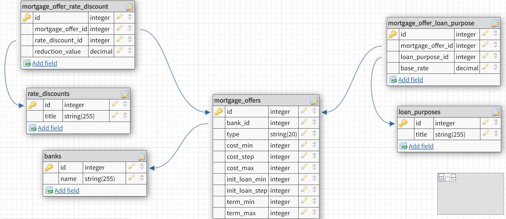

## About This Project

This is a mortgage calculator and aggregator with the ability to view the schedule of annuity, as well as differentiated loan payments. It is build using Laravel, Vue 3 with focus on Composition API, GraphQL with Lighthouse + Apollo Client 3 and Typescript code in AirBnB style. The project also uses the Ionic UI Components (mobile app framework).

## Requirements

This package must be installed on either a Laravel Homestead/Valet enabled webserver, or a LAMP/LEMP instance that meets Laravel's minimum requirements.

Installation requires Composer and NPM.

## To install

- Clone repository into webserver/application directory.
- Run composer install from application directory.
- Duplicate .env.example and rename copy to .env. Update configuration values as required.
- Generate app key by running php artisan key:generate from application directory.
- Install database tables by running php artisan migrate from application directory.
- Go to resources/js subdirectory and run npm install, then run npm run build

## DB Schema

